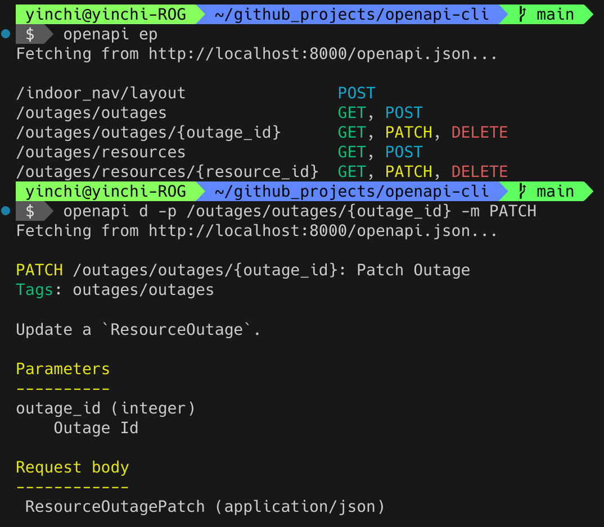

# CLI for working with APIs using the OpenAPI specifications


)


Author: Yin-Chi Chan

> [!WARNING]
> This Python package is very preliminary. There will be bugs(!), and not all OpenAPI specifications will be able to be parsed.
>
> Check [TODO.md](TODO.md) for a list of features to be added.

### Running the CLI app

- Option 1: `uv run`
    ```bash
    cd /path/to/project
    uv run openapi <args>
    ```
- Option 2: global install with `pipx` (editable)
  ```bash
  cd /path/to/project
  pipx install -e .
  openapi <args>
  ```

### Documentation

Run `openapi <cmd> -h` to see usage information for each command or `openapi -h` for a list of commands.

### Screenshot


